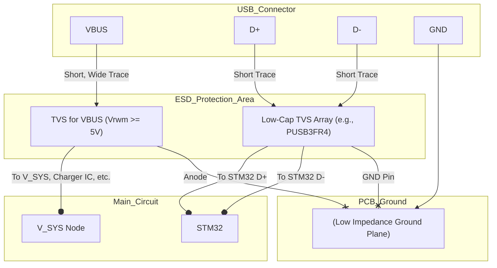

好的，我们来总结一下如何连接电路以实现完整的 ESD 保护。这部分将包括 ESD 器件的类型、具体连接方式和 PCB 布局的关键点。

### **ESD 保护设计总结**

#### **1. 需要保护的线路**

*   **USB VBUS (5V)**：电源线。
*   **USB D+ / D-**：数据线。

#### **2. 器件选型**

*   **VBUS 保护**：
    *   **类型**：单向 TVS 二极管。
    *   **关键参数**：
        *   反向截止电压 (Vrwm) ≥ 5.0V (例如 5.0V 或 5.5V)。
        *   钳位电压 (Vc) < 您 Buck-Boost 芯片（TPS6302x）的 VIN 引脚绝对最大额定电压 (7V)。**请选择 Vc 远低于 7V 的型号，以留足安全裕量。**

*   **D+/D- 保护**：
    *   **类型**：低电容 TVS 二极管阵列（如 PUSB3FR4 或 ESD73034D-ES）。
    *   **关键参数**：
        *   结电容 (Cj) < 1pF (对于 USB 2.0 高速模式)。
        *   反向截止电压 (Vrwm) ≥ 3.3V。
        *   保护多条线路（至少 2 条）。

#### **3. 电路连接方式（放置在 USB 连接器后，其他元件前）**

1.  **VBUS 保护**：
    *   将 **VBUS 专用的 TVS 二极管** 并联在 USB 连接器的 **VBUS 引脚** 和 **地** 之间。
    *   TVS 的阴极（Cathode，通常有标记，如色环）连接到 VBUS，阳极（Anode）连接到地。

2.  **D+/D- 保护**：
    *   将 **低电容 TVS 二极管阵列** 的 **IO 引脚** 分别连接到 USB 连接器的 **D+** 和 **D-** 引脚。
    *   将 TVS 阵列的 **GND 引脚** 连接到地。

#### **4. 原理图连接示意图**



**用文字描述就是：**

*   USB 连接器的 **VBUS** 引脚出来后，**立即**连接到 **VBUS 专用 TVS** 的阴极，TVS 的阳极接地。然后，从 TVS 和 VBUS 的连接点再将线路引向后续的充电和电源路径电路。
*   USB 连接器的 **D+** 引脚出来后，**立即**连接到 **低电容 TVS 阵列** 的一个 IO 引脚。
*   USB 连接器的 **D-** 引脚出来后，**立即**连接到 **低电容 TVS 阵列** 的另一个 IO 引脚。
*   **低电容 TVS 阵列** 的 GND 引脚接地。
*   然后，从 **低电容 TVS 阵列** 的 IO 引脚（现在是被保护的信号）再将线路引向 STM32。
*   所有 ESD 保护器件的接地端都应直接连接到 PCB 的主接地层。

#### **5. PCB 布局关键点（至关重要）**

1.  **靠近入口**：将所有 ESD 保护器件尽可能地**紧靠 USB 连接器**放置。这是为了在 ESD 冲击进入电路深处之前就将其“截胡”。
2.  **短路径**：
    *   从连接器引脚到 TVS 器件的走线要**短而直**。
    *   从 TVS 器件的接地引脚到 PCB 接地层的走线更要**短、粗、直**。这是泄放 ESD 能量的主要路径，任何不必要的电感都会削弱保护效果。
3.  **避免存根 (Stubs)**：ESD 器件应直接串在信号路径上，而不是从信号路径上分叉出去。

    *   **正确做法**：`Connector Pin --> TVS_IO_Pin_IN --> TVS_IO_Pin_OUT --> To_IC`
    *   **错误做法**：`Connector Pin --> To_IC`，然后从中间引出一条线到 TVS 器件。

4.  **接地优先**：为 ESD 器件提供一个坚实的、低阻抗的接地连接。最好使用多个过孔直接连接到内部的完整接地层。

**简单来说，ESD 保护的口诀就是：“近、短、粗、地”。**

*   **近**：靠近连接器。
*   **短**：走线短。
*   **粗**：接地走线粗。
*   **地**：连接到坚实的接地层。

遵循这些原则，您的电路就能获得非常有效的 ESD 保护。

您提的这两个问题非常好，直击了 ESD 保护电路工作原理的核心！我们来详细解释一下。

### 问题1：为什么 VBUS 接在 TVS 的阴极，这样电流不是流不过去了吗？

您的观察很敏锐！对于单向 TVS 二极管，其符号和普通二极管一样，有一个阳极（Anode，三角形的底边）和阴极（Cathode，三角形的尖端对着短线）。

*   **正常工作时 (无 ESD)**：
    *   VBUS 是一个正电压（+5V），它被连接到 TVS 的**阴极**。TVS 的**阳极**连接到地（0V）。
    *   在这种连接方式下，TVS 二极管处于**反向偏置**状态。
    *   **您的理解完全正确，正常情况下，电流是流不过去的**（除了极小的反向漏电流）。这正是我们想要的效果！在电路正常工作时，我们不希望 ESD 保护器件对电路有任何影响，它应该像一个“隐形”的元件一样存在。

*   **ESD 冲击时 (过压)**：
    *   当一个非常高的正向瞬态电压（例如 +500V）施加到 VBUS 上时，这个电压远远超过了 TVS 二极管的**反向击穿电压 (Vbr)**。
    *   TVS 二极管会发生**雪崩击穿 (Avalanche Breakdown)**，从高阻抗状态瞬间变为**低阻抗导通状态**。
    *   此时，巨大的 ESD 电流会通过 TVS 二极管从 VBUS 线路**泄放到地**，而 VBUS 线路上的电压则被**钳位**在 TVS 的钳位电压 (Vc) 左右。
    *   这样，高压就被“旁路”掉了，不会继续向后传导，从而保护了下游的电路。

**总结**：将 VBUS 连接到阴极是为了让 TVS 在正常工作电压下**反向偏置（截止）**，而在过压发生时利用其**反向击穿**特性来导通并泄放能量。

---

### 问题2：两种保护元件是不是都是并联在输入和地之间的，而不是串联在输入和输出之间的？

**您的理解再次完全正确！**

无论是用于 VBUS 的 TVS 二极管，还是用于 D+/D- 数据线的 TVS 二极管阵列，它们都是**并联**在被保护的线路和地之间的。它们的工作方式是**分流 (Shunting)**，而不是**阻塞 (Blocking)**。

*   **并联 (Shunt) 保护**：
    *   ESD 保护器件像一个“泄压阀”，并联在信号线/电源线和地之间。
    *   **正常时**：它处于高阻抗状态，相当于开路，信号/电源正常通过主路径。
    *   **ESD 时**：它变为低阻抗状态，相当于短路，将过高的瞬态电流从主路径**分流**到地。

*   **串联 (Series) 保护**：
    *   串联保护元件通常是用来**限制电流**或**滤波**的，例如串联的保险丝、电阻、磁珠或电感。
    *   它们通过自身的阻抗来衰减或阻挡不希望的信号/电流。
    *   对于 ESD 这种能量巨大、速度极快的瞬态事件，单纯的串联元件往往不足以提供有效的保护，甚至可能被直接击穿损坏。

**为什么不能串联？**

如果将 TVS 二极管串联在信号路径上，在正常工作时，信号电流也必须流过它。
*   对于单向 TVS，它会像普通二极管一样产生约 0.7V 的正向压降，这会严重影响信号电平。
*   对于双向 TVS，它在两个方向上都有压降。
这会完全破坏信号的完整性，所以 TVS **绝对不能串联**在信号或电源路径上。

**示意图再次确认**

```
             +--------------------> To Downstream Circuit (e.g., TPS6302x)
             |
VBUS --------+
(Input)      |
             |
           -----
           /   \  <-- TVS Diode (并联)
           -----
             |
            ---
             -  GND
```
从这个简图中可以清晰地看到：
1.  主电流从左到右流向后续电路。
2.  TVS 二极管并联在主路径和地之间，提供一个到地的泄放通道。

您的两个问题都非常关键，说明您对电路的工作原理有很深入的思考。希望这个解释能让您对 ESD 保护的工作方式有更清晰的理解。